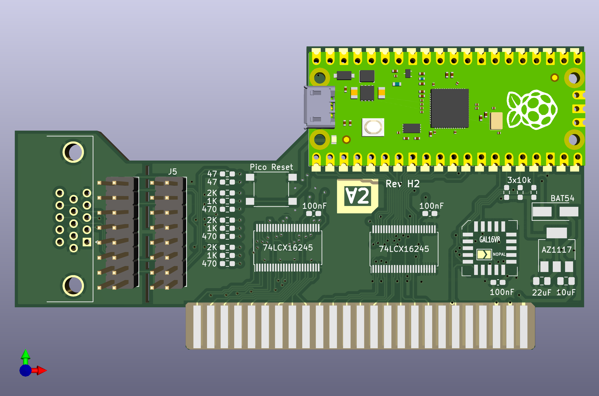

# ∀2 Retro Computing Analog VGA Card & PicoPal

This is a fork of
[David Kuder's version](https://github.com/V2RetroComputing/analog) of
[Mark Aikens' Apple II VGA](https://github.com/markadev/AppleII-VGA/)
project.

The goal of this fork is to make the board cheaper and easier to
produce.  It is now a 2 layer instead of a 4 layer PCB, uses cheaper
bus transceivers and 0603 passive components that are easier to work
with when building the board by hand.

The board provides a VGA output to Apple II compatible machines.  It works by
snooping the bus activity and capturing what is written to the internal
graphics hardware.  This is used to render an additional image into a
framebuffer on the Raspberry Pi Pico.  That framebuffer is output
to a standard VGA compatible output.

The VGA emulation starts up with a test screen.  Reset your Apple to
go to the BASIC prompt or boot screen.

The footprint of the VGA IDC connector on the board is incorrect.  The
red wire of the ribbon cable must be facing down, in direction of the 
motherboard.  If you get no picture, try rotating the cable.

Alternatively, the card can run a Z80 emulation in software, emulating
a standard Z80 softcard.  To use that mode, the Raspberry Pi Pico must
be re-flashed.

Please use
[GitHub Issues](https://github.com/hanshuebner/AppleII-VGA/issues) to
provide feedback.  THANK YOU!

